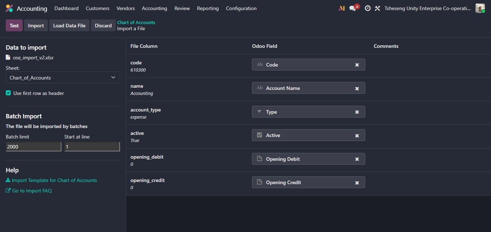
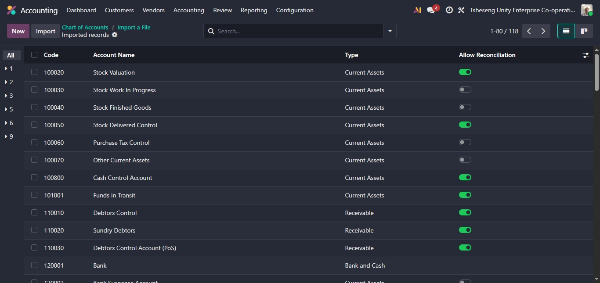

# Odoo Cooperative Accounting Logic
## Project Overview
Implementation of a custom Odoo ERP financial structure for **Tsheseng Unity Enterprise**.

**Technical Architecture Lab:** [Morganhub.lovable.app](https://morganhub.lovable.app)

### Key Technical Challenges Solved:
* **Asset Optimization:** Configured a Fixed Asset pipeline to capitalize renovation costs for the Old School Site.
* **Capital vs Revenue:** Automated distinction between Member Equity (R100) and Subscriptions (R30).
* **Data Integrity:** Established a relational onboarding strategy for 30 members using Odoo External IDs.

### Repository Structure
* `/chart_of_accounts`: Finalized Odoo-ready Excel import templates.
* `/member_management`: Partner relational data and receivable links.
* 
### Implementation Validation

*Validated the Chart of Accounts structure against Odoo 17/18 internal requirements, ensuring zero mapping conflicts.*

*Validated Import records successful- 129 records
## 👥 Cooperative Member Relational Onboarding

### **The Challenge**
Managing 30 unique member profiles within a poultry cooperative requires more than just a contact list; it requires establishing a relational link between **Partner Data**, **Member Equity (Capital)**, and **Subscription Tracking**.

### **The Solution**
I designed a custom import strategy using **Odoo External IDs** to ensure data integrity during the migration from manual records.

* **Relational Mapping:** Linked member profiles directly to specific equity accounts to track individual contributions automatically.
* **Scalability:** Configured the `res.partner` model to handle custom cooperative metadata, allowing for easy batch updates as the cooperative grows.
* **Validation:** Verified all 30 records against Odoo 19 internal requirements to prevent duplicate entries and mapping conflicts.

### **Implementation Results**
* **100% Accuracy:** Successfully imported all member records with zero relational link failures.
* **Automated Equity Tracking:** Each member is now programmatically linked to their financial stake in the cooperative.
